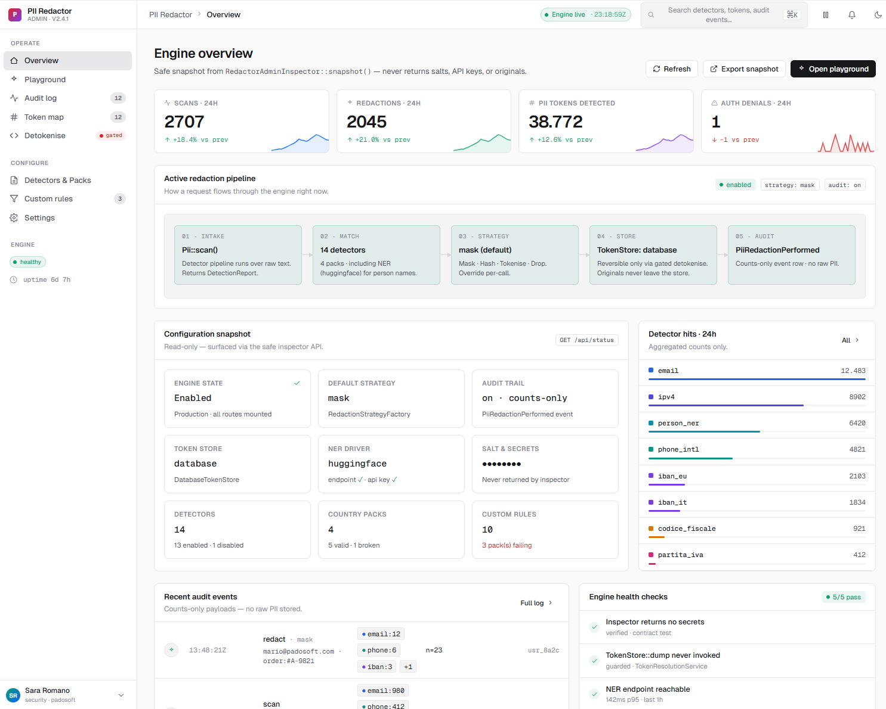
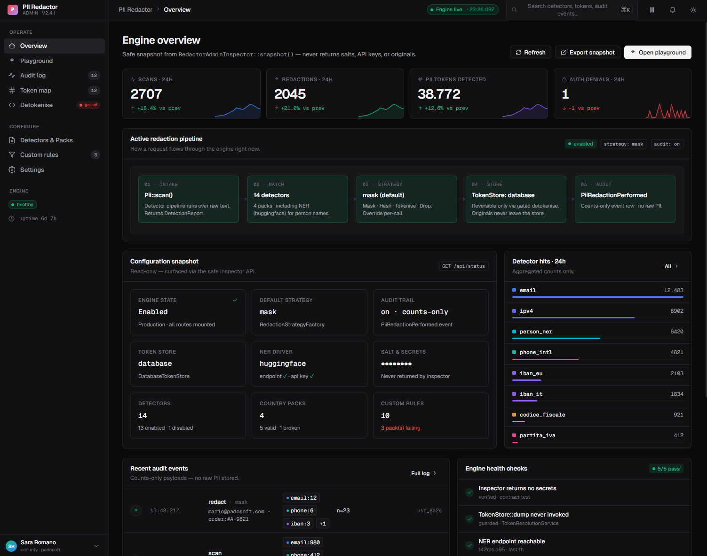
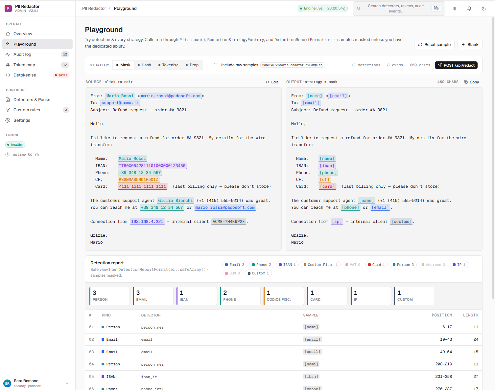
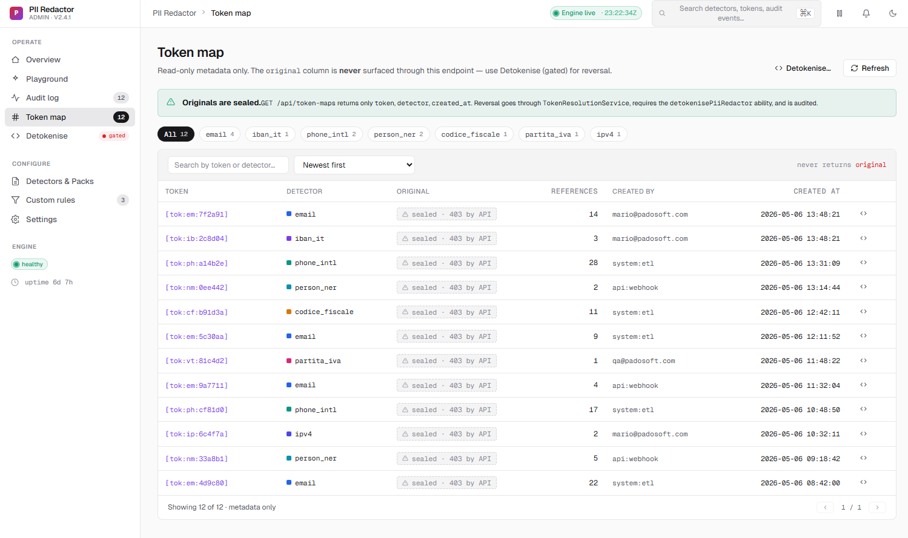
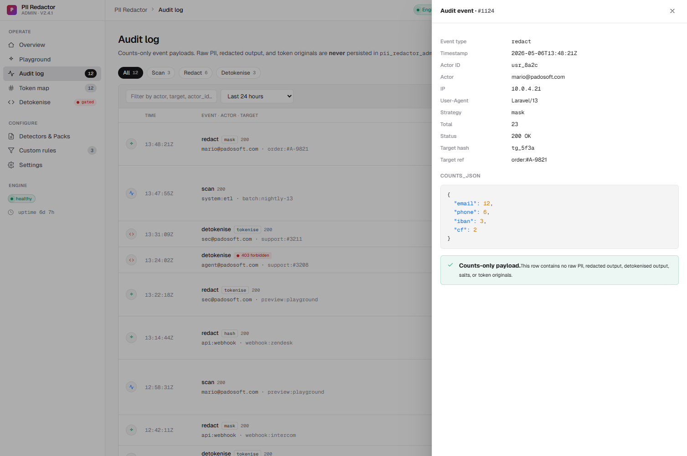
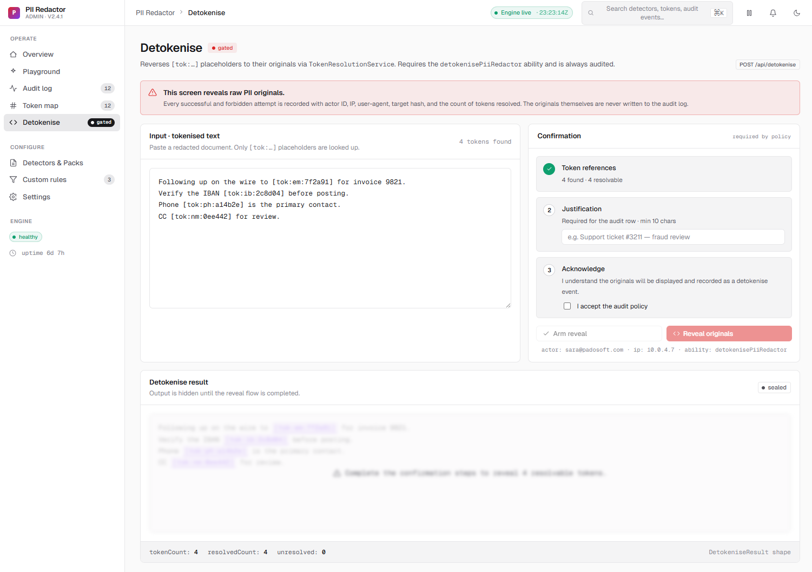
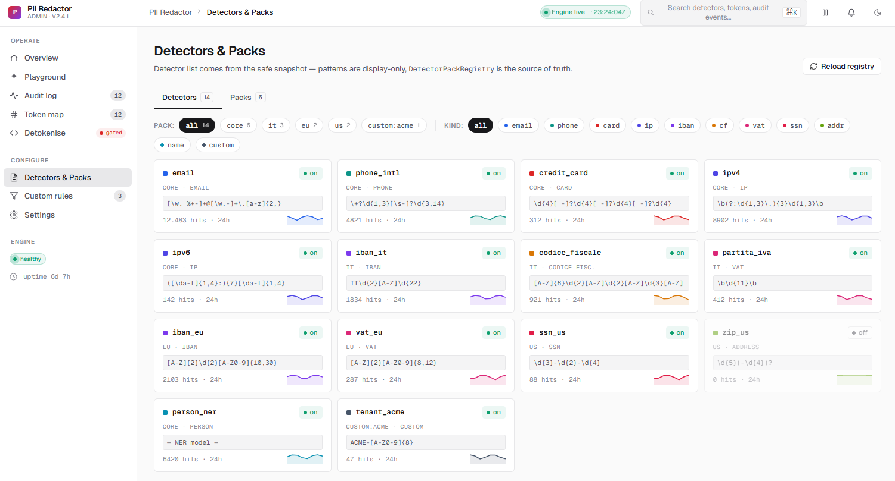
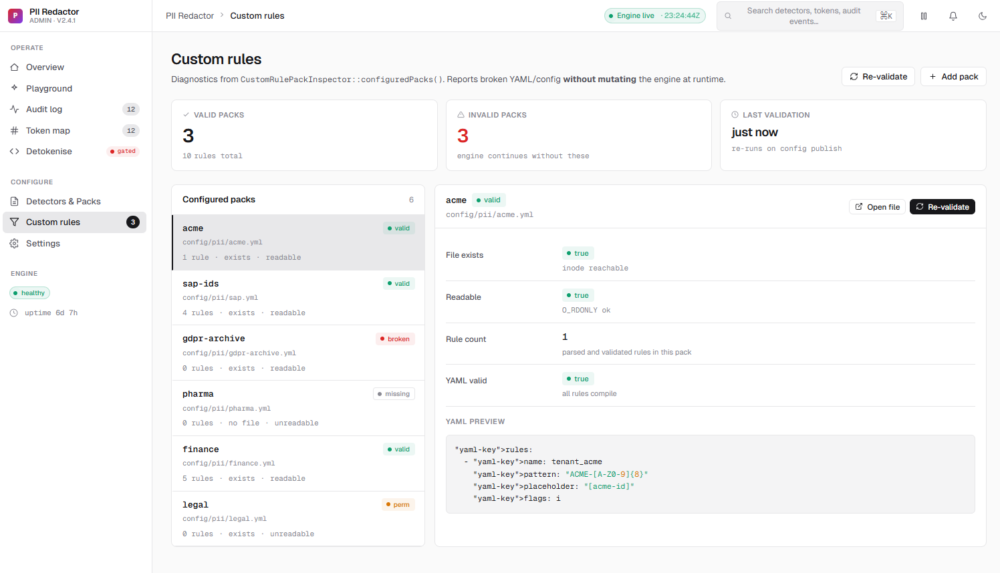

# Laravel PII Redactor Admin

Installable Laravel 13 admin console for [`padosoft/laravel-pii-redactor`](https://github.com/padosoft/laravel-pii-redactor).

## Table Of Contents

- [Status](#status)
- [Screenshots](#screenshots)
- [Security Model](#security-model)
- [Installation](#installation)
- [Authorization](#authorization)
- [Demo Fixtures](#demo-fixtures)
- [Verification](#verification)
- [Release](#release)

## Status

This package is disabled by default and exposes a secure Blade + Vite + React admin surface when enabled.

```env
PII_REDACTOR_ADMIN_ENABLED=true
PII_REDACTOR_ADMIN_ROUTE_PREFIX=pii-redactor-admin
PII_REDACTOR_ADMIN_API_PREFIX=pii-redactor-admin/api
```

Default abilities:

- `viewPiiRedactorAdmin`
- `detokenisePiiRedactor`
- `viewPiiRedactorRawSamples`

## Screenshots

Design references are committed under [`resources/screenshots`](resources/screenshots). The original misspelled `resources/screenshoots` directory was normalized to `resources/screenshots`.

| Page | Preview |
| --- | --- |
| Dashboard |  |
| Dark dashboard |  |
| Playground |  |
| Token map |  |
| Audit logs |  |
| Detokenise |  |
| Detectors |  |
| Custom rules |  |

## Security Model

- Token-map listing never selects or serializes token originals.
- Detokenise requires authorization, justification, token validation, throttling, and audit rows.
- Raw scan samples require a dedicated ability.
- Audit rows store metadata, counts, target hashes, status, and justification only.

## Installation

When both packages are available from Packagist, installation is direct:

```bash
composer require padosoft/laravel-pii-redactor-admin
```

If this admin package is available from Packagist but the core package is not, add only the core package repository in the host app first:

```bash
composer config repositories.pii-redactor vcs https://github.com/padosoft/laravel-pii-redactor
```

```bash
composer require padosoft/laravel-pii-redactor-admin
php artisan vendor:publish --tag=pii-redactor-admin-config
php artisan vendor:publish --tag=pii-redactor-admin-migrations
php artisan migrate
```

If neither package is available from Packagist yet, add both repositories before requiring the admin package:

```bash
composer config repositories.pii-redactor vcs https://github.com/padosoft/laravel-pii-redactor
composer config repositories.pii-redactor-admin vcs https://github.com/padosoft/laravel-pii-redactor-admin
composer require padosoft/laravel-pii-redactor-admin
```

For local development of this admin package from a checkout:

```bash
composer config repositories.pii-redactor vcs https://github.com/padosoft/laravel-pii-redactor
composer config repositories.pii-redactor-admin path /absolute/path/to/laravel-pii-redactor-admin
composer require padosoft/laravel-pii-redactor-admin:@dev
php artisan vendor:publish --tag=pii-redactor-admin-config
php artisan vendor:publish --tag=pii-redactor-admin-migrations
php artisan migrate
```

Enable the console only in trusted environments and keep `web,auth` or stricter middleware on both UI and API routes.

The React/CSS assets are compiled into the package and served through the enabled admin route prefix. Host applications do not need to add this package's Vite inputs to their own `vite.config.ts`.

## Authorization

Define the host gates before enabling the package:

```php
Gate::define('viewPiiRedactorAdmin', fn ($user) => $user->can('manage-pii-redactor'));
Gate::define('detokenisePiiRedactor', fn ($user) => $user->can('detokenise-pii'));
Gate::define('viewPiiRedactorRawSamples', fn ($user) => $user->can('view-raw-pii-samples'));
```

Detokenise additionally requires a token-shaped input, a justification of at least 10 characters, UI confirmation, throttling, and audit persistence.

## Demo Fixtures

Safe demo payloads live in `resources/demo/admin-api-fixtures.json` and are reused by Playwright. They intentionally omit token originals, raw samples, redacted output persistence, salts, and API keys.

## Verification

Frontend development and CI use Node.js 24 or newer.

Every task must keep these gates green locally and in GitHub Actions:

```bash
composer validate --strict
vendor/bin/phpunit
npm run typecheck
npm run test
npm run build
npm run e2e
```

Fresh host install verification can be run from the package root:

```powershell
./scripts/verify-fresh-laravel-host.ps1
```

Release readiness notes live in `docs/RELEASE.md`.

## Release

Current runtime release: [`v1.0.1`](https://github.com/padosoft/laravel-pii-redactor-admin/releases/tag/v1.0.1).

`v1.0.2` is reserved for the final docs/test-hardening ledger after `v1.0.1`.
